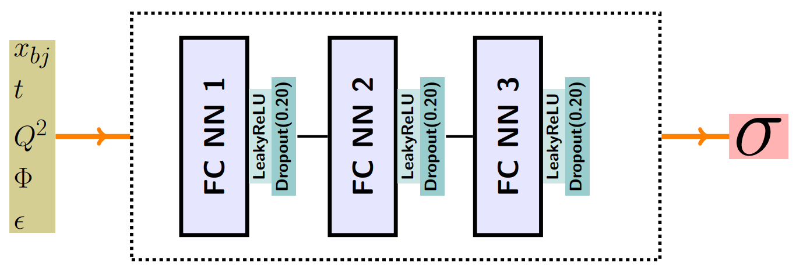

# Physics Conatrained Deep Neural Networks (PCNNs) For DVCS Cross Sections

- This is the implementation of PCNNs of our paper (**"Defining the Benchmarks for a Global Extraction of Information from Deeply Virtual Exclusive Scattering"**), https://arxiv.org/abs/2207.10766 .
- PCNNs is a neural network that incorporates some of the physics knowledge. In particular: error bars and Parity Invariance constraints


    
# Requirements

- The code is written in Python=3.8.6, with tensorflow== 2.9.2
- The list of all libraries with the dependencies is in the file:
``` bash
requirements.txt
``` 
## Getting started
* Install the python libraries.
* Download the code from GitHub:
```bash
git clone https://github.com/Malmaeen/FemtoNet_PCNNs.git
cd FemtoNet_PCNNs
```

* To reproduce the results of the DVCS data with a saved model, run the python script:
``` bash
python driver.py
``` 
